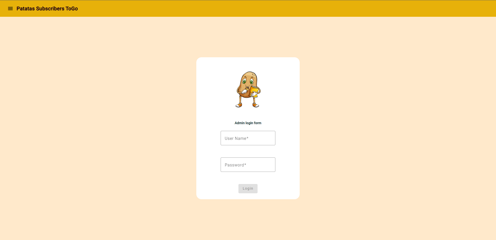
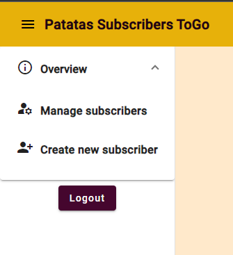
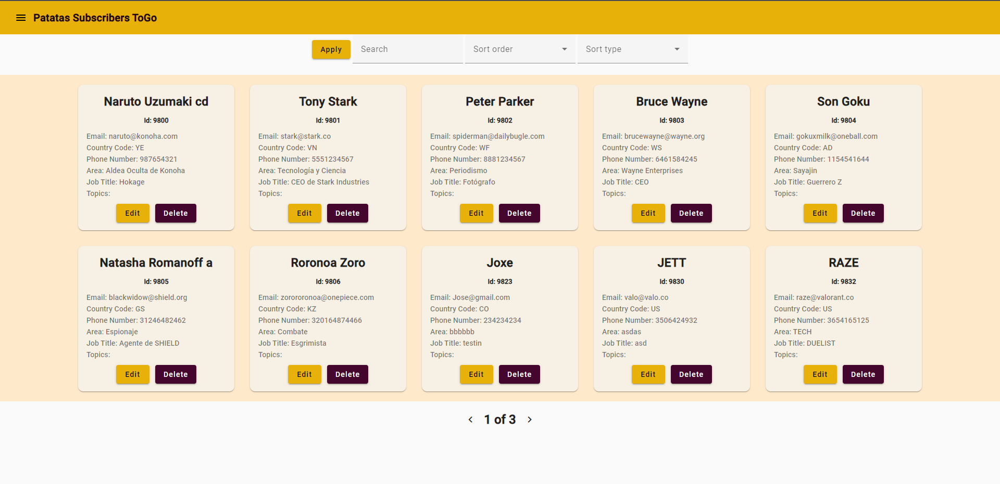
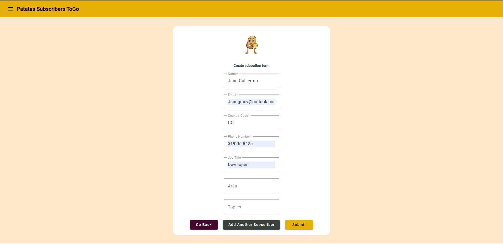
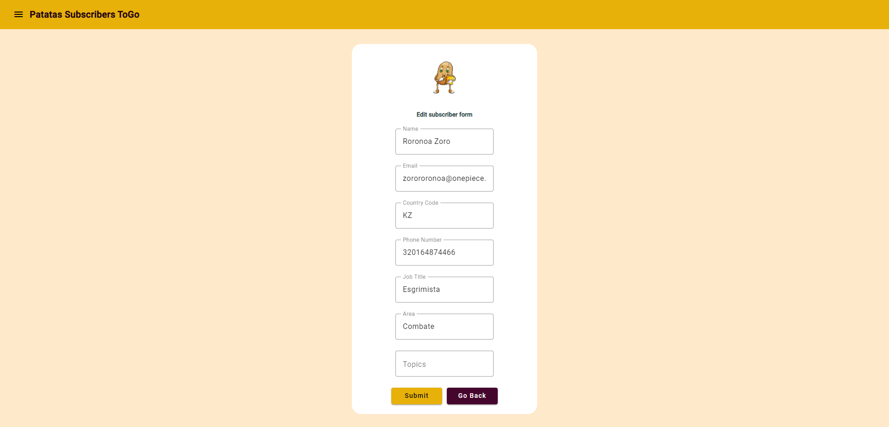

# Tekus - Front End Technical Test

## Patatas Subscribers ToGo

## Description

This project is the result of the development process for the technical front-end test proposed by Tekus. Also meets all the requirements related to the final result expected.

The main purpose of this admin app is to manage all the subscribers of the company "Patatas Subscribers ToGo" such as creating a new subscriber, editing an existing subscriber, deleting an existing subscriber, and finally having multiple ways to filter all the subscribers in order to facilitate their manipulation.

 

## Big Picture

### Login

The image below shows the login page, where you can access the app if you have the respective credentials.

 

### Side Navigation Bar

In the following image, you can see the side navigation bar, where you can manage all the existing subscribers, create a new subscriber, and finally close the session by clicking on the logout button.

 

### Manage Subscribers Page

The following image shows the main space where you can edit and delete all the existing subscribers. Also, you can use the filters that are above the page in order to easily find the subscriber you need.

 

### Create Subscribers Page

You can create a new subscriber using the form shown in the image below. Once you have filled out all the fields correctly, you only have to click the "submit" button, or if you want to exit this page, you only have to click on the "Go Back" button, and you will be redirected to the "manager-subscribers page".

 

### Edit Subscribers Page

If you want to edit an existing subscriber, you only have to click on the "Edit" button located in the user card, and you will be redirected to the following page:

Here you have to change all the information you want to edit, and once you finish it, you have to click on the "edit" button, or if you want to cancel the operation, just click on the "Go Back" button, and you will be redirected to the "manager-subscribers page".

 

This project was generated with [Angular CLI](https://github.com/angular/angular-cli) version 16.0.0.

## Development server

Run `ng serve` for a dev server. Navigate to `http://localhost:4200/`. The application will automatically reload if you change any of the source files.

## Code scaffolding

Run `ng generate component component-name` to generate a new component. You can also use `ng generate directive|pipe|service|class|guard|interface|enum|module`.

## Build

Run `ng build` to build the project. The build artifacts will be stored in the `dist/` directory.

## Running unit tests

Run `ng test` to execute the unit tests via [Karma](https://karma-runner.github.io).

## Running end-to-end tests

Run `ng e2e` to execute the end-to-end tests via a platform of your choice. To use this command, you need to first add a package that implements end-to-end testing capabilities.

## Further help

To get more help on the Angular CLI use `ng help` or go check out the [Angular CLI Overview and Command Reference](https://angular.io/cli) page.

 

## Developer

Juan Guillermo Muñoz Correa
